# Study guide 00 · The visual tour

_Eleven diagrams, one idea each, in the order a new builder meets them. Every diagram links to the file that is the source of truth; where a diagram and its source disagree, the source wins and this page is the bug. The lifecycle's full state machine is [`storyline/lifecycle/state-machine.md`](../../storyline/lifecycle/state-machine.md)._

Time: 30 minutes. Audience: anyone new to the repository — builders, approvers, security reviewers, and the AI agents that will enhance it.

---

## 1. The repository in one picture

Three parts. The root is the stories-as-code layer. `storyline/` is the Storyline: how a story moves. `kit/` is what a new customer imports on day one.

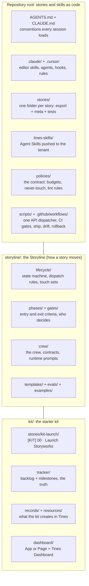

**Read next:** the root [`README.md`](../../README.md), [`storyline/README.md`](../../storyline/README.md), [`kit/README.md`](../../kit/README.md).

---

## 2. The four modes

Model Context Protocol (MCP) appears in Tines Stories in four places. This repository only ever calls them modes. It authors in Mode 2, runs its monitor in Mode 3, and exposes its ops lookups in Mode 4.

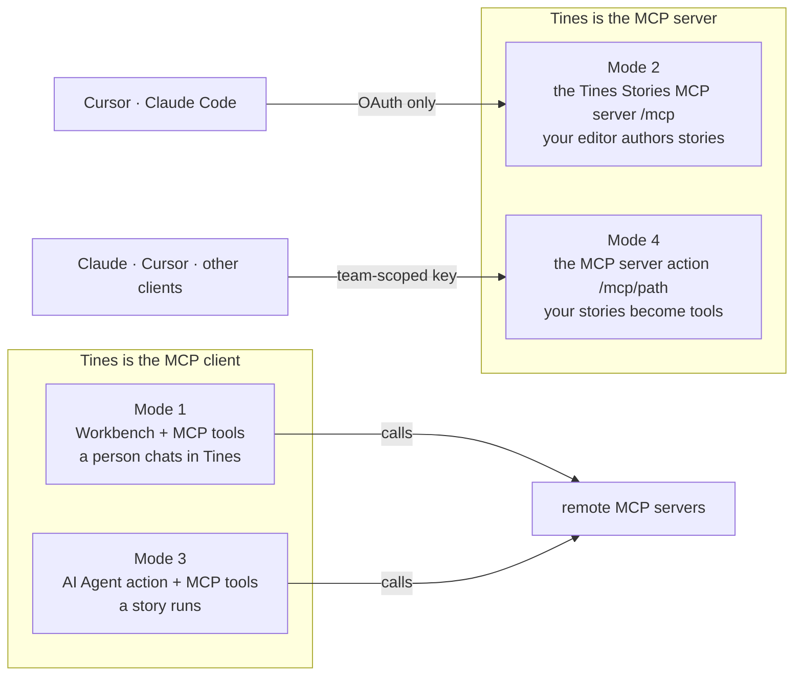

**In this repository:** Mode 2 is every build ([`AGENTS.md`](../../AGENTS.md) §2). Mode 3 is the ops monitor ([`stories/ops-story-health-monitor/`](../../stories/ops-story-health-monitor/README.md)). Mode 4 is the ops tools server ([`stories/ops-tools-server/`](../../stories/ops-tools-server/README.md)). Mode 1 is optional.

---

## 3. The build loop: one story, from an editor

A person asks; the builder subagent, the only context that holds the Tines Stories MCP server, plans, builds in the dev team, validates, tests and exports. Hooks run whether or not the model agrees.

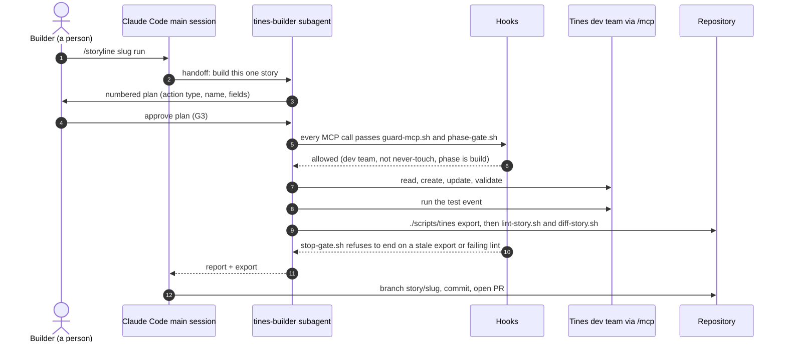

**Read next:** [`.claude/skills/tines-build-story/SKILL.md`](../../.claude/skills/tines-build-story/SKILL.md), [`.claude/agents/tines-builder.md`](../../.claude/agents/tines-builder.md), [`CLAUDE.md`](../../CLAUDE.md) §c for the hooks.

---

## 4. The ship path: from pull request to production

Nothing reaches production except through a merged pull request, a draft, a change request and a named person approving in Tines. CI can open a change request; it cannot approve one.

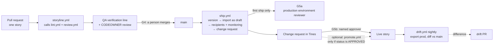

**Read next:** [`docs/02-workflows.md`](../02-workflows.md) §2, [`policies/POLICY.md`](../../policies/POLICY.md), [`.github/workflows/ship.yml`](../../.github/workflows/ship.yml).

---

## 5. The lifecycle at a glance

Eight phases, eleven gates. Human gates are the ones that change what exists or what runs. The full state machine, with every transition, is [`storyline/lifecycle/state-machine.md`](../../storyline/lifecycle/state-machine.md).

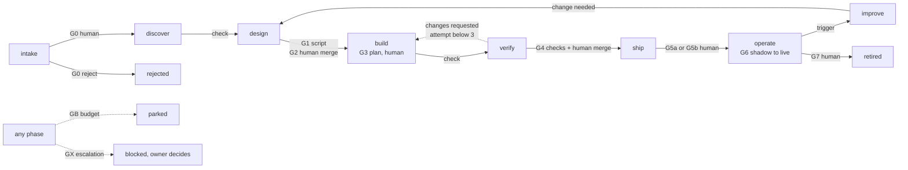

**Read next:** [`storyline/gates/README.md`](../../storyline/gates/README.md), then one phase file, for example [`storyline/phases/02-design.md`](../../storyline/phases/02-design.md).

---

## 6. The crew, and where each one runs

Narrow agents, one job each. Code decides who runs next, never a model. Only `tines-builder` holds the Tines Stories MCP server. The Tines-side agents hold no tools and no credentials.

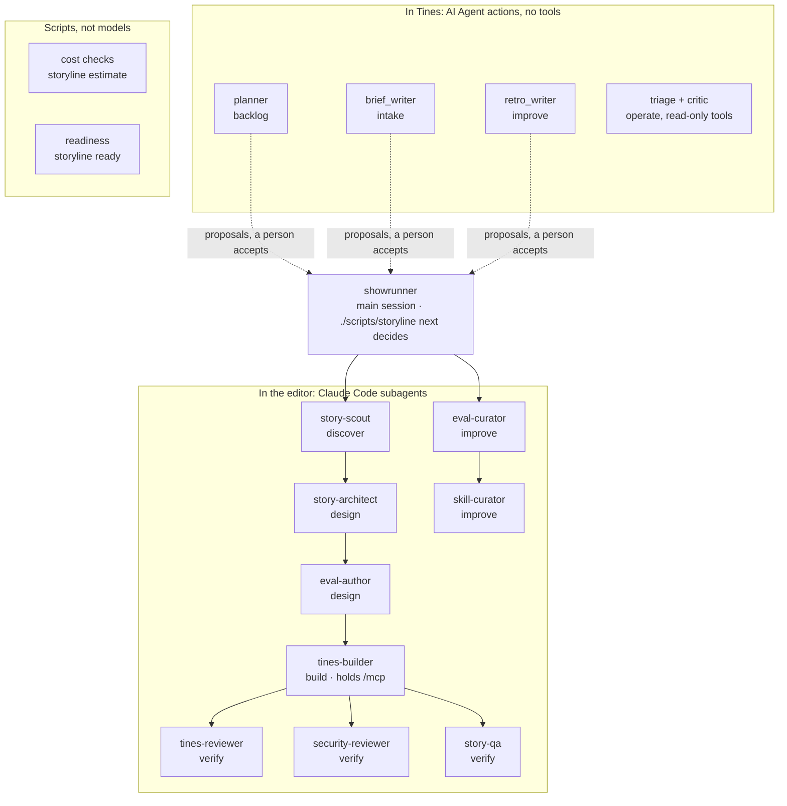

**Read next:** [`storyline/crew/README.md`](../../storyline/crew/README.md) (the roster and the spin-up matrix), one role card such as [`storyline/crew/story-architect.md`](../../storyline/crew/story-architect.md).

---

## 7. How a crew member hands off

Crew never write files directly. They return one JSON baton; `./scripts/storyline apply` validates it, checks the touch set, writes, appends an event and updates the tracker, and asks a person first.

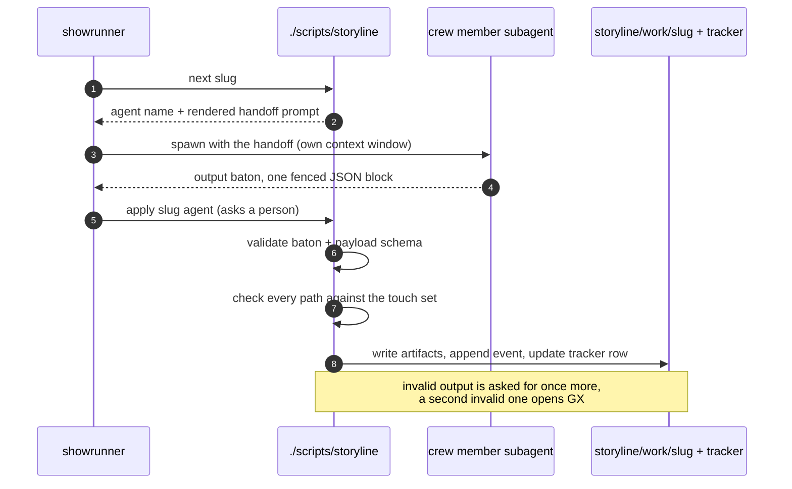

**Read next:** [`storyline/crew/contracts/baton.schema.json`](../../storyline/crew/contracts/baton.schema.json), [`storyline/lifecycle/touch-sets.yaml`](../../storyline/lifecycle/touch-sets.yaml).

---

## 8. The monitoring loop: agentic, but a person decides

Every production story reports to the ops router. The health sweep's agent reads evidence through read-only tools and proposes; a critic checks it; a person approves; a fix arrives as a pull request.

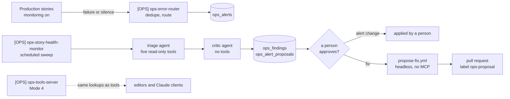

**Read next:** [`stories/ops-story-health-monitor/README.md`](../../stories/ops-story-health-monitor/README.md), [`docs/03-monitoring-story.md`](../03-monitoring-story.md), [`.github/workflows/propose-fix.yml`](../../.github/workflows/propose-fix.yml).

---

## 9. Day one: what the starter kit does

Import one story, answer one Page. The story branches on what the tenant bought, provisions deterministically, checks the model provider, and writes a setup report. No kit AI Agent action runs until a person switches the guards on.

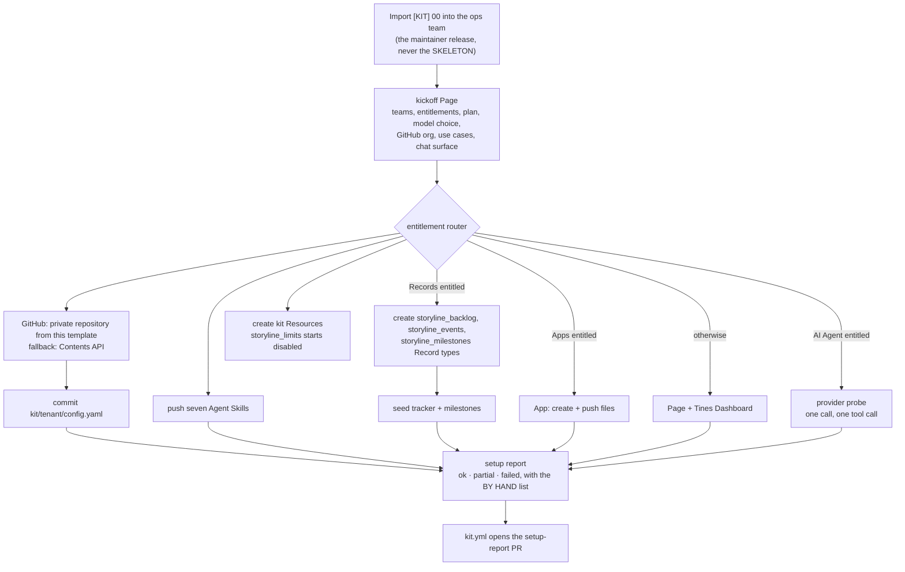

**Read next:** [`kit/README.md`](../../kit/README.md), [`kit/ONBOARDING.md`](../../kit/ONBOARDING.md), [`stories/kit-launch/README.md`](../../stories/kit-launch/README.md).

---

## 10. The tracker: git is the truth, Records is the view

Two flows, and they never write the same fields. Decisions made in Tines reach git only when a person merges.

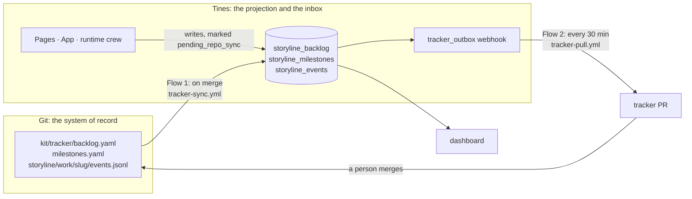

**Read next:** [`kit/tracker/README.md`](../../kit/tracker/README.md), [`REPO-DESIGN.md`](../../REPO-DESIGN.md) §6.5.

---

## 11. Trust boundaries: who holds what

No secret lives in the repository, the prompt or the model's context. Each identity can do one job.

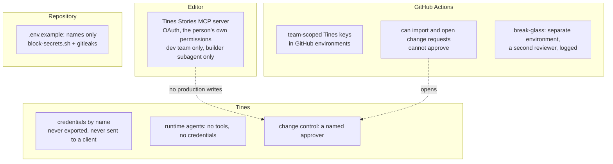

**Read next:** [`docs/04-security-model.md`](../04-security-model.md), [`policies/POLICY.md`](../../policies/POLICY.md) §1.

---

## Check yourself

1. Which mode does a build use, and why does only one subagent hold it?
2. Name the three human gates between a design and a live story.
3. What stops CI from promoting a change request nobody approved?
4. Where is a story's phase stored, and which side wins when git and Records disagree?
5. What does the monitoring agent do when it finds a failing story, and what does it never do?
6. Which kit steps can no API perform, and where is that list?

Answers: [`AGENTS.md`](../../AGENTS.md) §2 and §3 · [`storyline/gates/README.md`](../../storyline/gates/README.md) · [`.github/workflows/promote.yml`](../../.github/workflows/promote.yml) · [`kit/tracker/README.md`](../../kit/tracker/README.md) · [`stories/ops-story-health-monitor/README.md`](../../stories/ops-story-health-monitor/README.md) · [`kit/README.md`](../../kit/README.md) "The [BY HAND] list".
