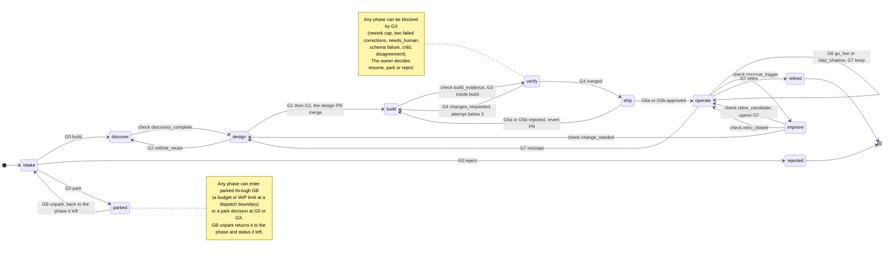

# The state machine, in prose

_The machine itself is [`state-machine.yaml`](state-machine.yaml) — the single source of phase, status and gate names. This page explains it; where the two differ, the YAML wins and this page is the bug. Spec: REPO-DESIGN.md §4.2._

## A story's state

A story is one row in `kit/tracker/backlog.yaml` (and one `storyline_backlog` Record in Tines). Its state is four fields:

| Field | Values | Notes |
|---|---|---|
| `phase` | `intake · discover · design · build · verify · ship · operate · improve` · holding `parked` · terminal `rejected`, `retired` | in that order |
| `status` | `active · awaiting_gate · rework · blocked` · in operate only `shadow · live` | `phase_info` lists which phase may hold which |
| `open_gate` | `none` or one of `G0 G1 G2 G3 G4 G5a G5b G6 G7 GB GX` | **at most one** per story |
| `attempt` | 0–3 | the rework counter within one design iteration |

**Invariants.** At most one open gate per story (`one_open_gate_per_story`). At most `wip_limit_per_owner` (default 1) stories in build or verify per owner.

## The diagram



The arrow `parked → intake` stands for "back to the phase it left", which is intake only for a story parked at G0. The same drawing in plain text, as REPO-DESIGN.md §4.2 has it:

```
                 G0: build            discovery_complete           G1 ✓ then G2 (design PR merged)
    intake ─────────────────▶ discover ─────────────────▶ design ──────────────────────────────▶ build
      │  G0: reject ▶ rejected    ▲                        │  ▲                                    │ build_evidence
      │  G0: park   ▶ parked      └──── G2: rethink_reuse ─┘  │ change_needed                      ▼
      │                                                       │                   G4: changes_requested (attempt < 3)
      │                                           improve ◀── operate ◀── G5 ── ship ◀── G4: merged ── verify
      │                              retro_closed ──▶ operate    │                                      │ attempt ≥ 3
      │                                                          │ G6: shadow ▶ live                    ▼
      │                                                          └── G7: retire ▶ retired          GX (blocked)
    any ── GB ──▶ parked ── unpark (human) ──▶ previous phase
```

## Every transition

Read top to bottom; the first row that matches wins (the YAML's order is the rule).

| From | To | By | Status after | Notes |
|---|---|---|---|---|
| intake | discover | G0 `build` | active | |
| intake | rejected | G0 `reject` | — | terminal |
| intake | parked | G0 `park` | awaiting_gate | |
| discover | design | check `discovery_complete` | active | written on `design/<slug>` |
| design | build | G1 then G2 (the merge) | active | the design PR carries the tracker change |
| design | discover | G2 `rethink_reuse` | active | the design PR is closed unmerged |
| build | verify | check `build_evidence` | active | G3 must be recorded inside build |
| verify | build | G4 `changes_requested`, attempt < 3 | rework | attempt + 1; a rework package |
| verify | verify | GX, attempt ≥ 3 | blocked | the rework cap |
| verify | ship | G4 `merged` | awaiting_gate, `open_gate` G5a or G5b | the build PR carries the tracker change |
| ship | operate | G5a `approved_and_imported` (manifest `new: true`) | shadow if `contract.risk.side_effects`, else live | first ship |
| ship | operate | G5b `approved_and_pushed` | shadow or live, as above | every later ship |
| ship | build | G5a or G5b `rejected` | rework | a revert PR on `rollback/<slug>/<sha>` first |
| operate | operate | G6 `go_live` / `stay_shadow` | live / shadow | |
| operate | improve | check `improve_trigger` | active | |
| improve | design | check `change_needed` | active | a new iteration; attempt → 0 |
| improve | operate | check `retire_candidate` | as before improve | G7 opens |
| improve | operate | check `retro_closed` | as before improve | |
| operate | retired | G7 `retire` | — | terminal; disable `[BY HAND]` |
| operate | operate | G7 `keep` | unchanged | |
| operate | design | G7 `rescope` | active | a new iteration; attempt → 0 |
| verify | build | GX `resume`, attempt ≥ 3 | rework | attempt → 0: a fresh budget granted by a person |
| any | same | GX `resume` | as before blocked | |
| any | parked | GX `park` | awaiting_gate | |
| any | rejected | GX `reject` | — | terminal |
| any | same | GX opens | blocked | |
| parked | the phase it left | GB `unpark` | as before parked | |
| any | parked | GB opens (budget or WIP) | awaiting_gate | only at a dispatch boundary |

Rows marked "added" in the YAML fill in decisions the `gate_decision` Page and `/storyline-gate` can record that REPO-DESIGN.md §4.2 does not draw: G6 `stay_shadow`, G7 `keep` and `rescope`, and GX `resume`, `park` and `reject`.

## The checks

Each check is deterministic, implemented in `scripts/storyline_state.py`, and lists the evidence it reads (the YAML's `checks:`):

| Check | Passes when |
|---|---|
| `discovery_complete` | `storyline/work/<slug>/discovery.md` exists; `reuse_decision` is set; every cited Library id is in `kit/catalog/library-seeds.yaml` |
| `build_evidence` | a `story/<slug>/*` branch exists; `story.meta.yaml` `exported_from.at` is later than the build start event; `./scripts/lint-story.sh` passes; `events.jsonl` holds a `gate_decision` event for G3 with `actor_kind: human` after the build start event |
| `improve_trigger` | an ops finding of severity high or critical; an eval regression; credits above 1.5 × the estimate; a retro due (7 days after live, then every `retro_cadence_days`); an owner request. The first three are evaluated Tines-side in `[KIT] 00` section D (D9); the last two repo-side |
| `change_needed` | `retro.md` `keep_or_change == change` |
| `retire_candidate` | `retro.md` `keep_or_change == retire_candidate` |
| `retro_closed` | `retro.md` is marked closed, and the eval cases it asked for are merged and passing |

## What `main` shows, and what a branch shows

Lifecycle state reaches `main` only through a PR a human merges (POLICY §2). So a branch carries its story's **in-flight** transitions, and `main` shows the last merged state:

- during discover and design, `main` reads `discover` until the design PR merges, then `build`;
- during build and verify, `main` reads `build` until the build PR merges, then `ship` (awaiting G5a or G5b);
- a Tines-side decision is **provisional** in Records until its tracker PR merges.

`phase-gate.sh` reads the row from `origin/main`, never the working tree, which is why no branch-local edit can open `/mcp`. `./scripts/storyline status <slug>` prints both views.

## The Tines-side dispatch table

`runtime_dispatch` in the YAML is copied into the `storyline_state_machine` Resource by `./scripts/kit bundle` and kept current by `kit-sync.yml`. Section D's Triggers read it; no model decides what runs:

| On | Runs |
|---|---|
| entering intake | `brief_writer` |
| entering improve | `retro_writer` |
| a backlog change (debounced 60 minutes) | `planner` |
| schedule | `retro_writer` 7 days after live, then every 30 days; `planner` weekly on Monday |

## Changing the machine

A change here ripples outward, and `./scripts/storyline check` (`phase_enum_in_sync`) fails until every copy agrees. In one PR (CODEOWNERS: tines-builders + security-platform):

1. Edit `state-machine.yaml` (and this page).
2. Update what is checked against it: the `TEXT_ENUM` values in `kit/records/*.record-type.json`, `kit/tracker/backlog.schema.json`, [`../observability/event.schema.json`](../observability/event.schema.json), and the enums in [`../templates/`](../templates/verify-report.schema.json).
3. Run `./scripts/kit bundle`, so `kit/bundle/kit-bundle.json` and the generated `storyline_state_machine` Resource match.
4. After the merge, `kit-sync.yml` pushes the Resource. The Record types are migrated **by a person**: `PUT /api/v1/record_types/{id}` adds fields, and changing a `TEXT_ENUM`'s values needs care — existing rows may hold a value that no longer exists (REPO-DESIGN.md §14, con 11).
